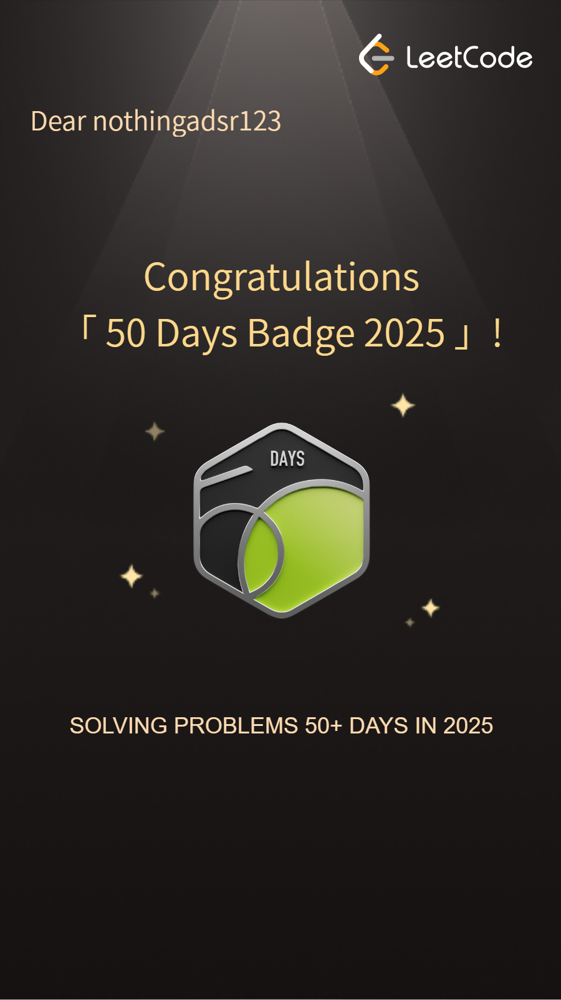

# DSA_Preparation  


A curated collection of Data Structures & Algorithms problems solved in Python.  

---

### 👤 About the Contributor

**Aditya Srivastava** — An enthusiastic learner aiming to be *job-ready* by mastering Data Structures & Algorithms.  
Passionate about writing clean Python code and solving problems with logic, not luck.  
*On a journey from curiosity → consistency → competency.*

Connect with me:  
- 💼 [LinkedIn](https://www.linkedin.com/in/aditya-srivastava-7390aa26a/)  
- 🧑‍💻 [LeetCode Profile](https://leetcode.com/nothingadsr123/)  
- 🐙 [GitHub](https://github.com/nothingADSR123)

<p align="center">
  
  
</p>

<p style="text-align:center;">
  <em>Consistency milestones earned on LeetCode through daily problem solving</em>
</p>


---


<!-- TopSWE_TABLE_START -->
<details>
<summary>TopSWE Problems (Total: 138)</summary>

| # | Problem | Link |
|---|---------|------|
| 1 | TwoSum | [Code](TopSWE/1.TwoSum.py) |
| 2 | AddTwoNumbers | [Code](TopSWE/2.AddTwoNumbers.py) |
| 3 | LongestSubstringWithoutRepeatingCharacters | [Code](TopSWE/3.LongestSubstringWithoutRepeatingCharacters.py) |
| 4 | MedianofTwoSortedArrays | [Code](TopSWE/4.MedianofTwoSortedArrays.py) |
| 5 | LongestPalindromicSubstring | [Code](TopSWE/5.LongestPalindromicSubstring.py) |
| 9 | PalindromeNumber | [Code](TopSWE/9.PalindromeNumber.py) |
| 12 | IntegertoRoman | [Code](TopSWE/12.IntegertoRoman.py) |
| 13 | RomantoInteger | [Code](TopSWE/13.RomantoInteger.py) |
| 14 | LongestCommonPrefix | [Code](TopSWE/14.LongestCommonPrefix.py) |
| 15 | ThreeSum | [Code](TopSWE/15.ThreeSum.py) |
| 17 | LetterCombinationsofaPhoneNumber | [Code](TopSWE/17.LetterCombinationsofaPhoneNumber.py) |
| 20 | ValidParentheses | [Code](TopSWE/20.ValidParentheses.py) |
| 21 | MergeTwoSortedLists | [Code](TopSWE/21.MergeTwoSortedLists.py) |
| 22 | GenerateParentheses | [Code](TopSWE/22.GenerateParentheses.py) |
| 23 | MergekSortedLists | [Code](TopSWE/23.MergekSortedLists.py) |
| 27 | RemoveElement | [Code](TopSWE/27.RemoveElement.py) |
| 28 | NeedleHaystack | [Code](TopSWE/28.NeedleHaystack.py) |
| 30 | SubstringwithConcatenationofAllWords | [Code](TopSWE/30.SubstringwithConcatenationofAllWords.py) |
| 33 | SearchinRotatedSortedArray | [Code](TopSWE/33.SearchinRotatedSortedArray.py) |
| 34 | FindFirstandLastPositionofinSortedArray | [Code](TopSWE/34.FindFirstandLastPositionofinSortedArray.py) |
| 35 | SearchInsertPosition | [Code](TopSWE/35.SearchInsertPosition.py) |
| 36 | ValidSudoku | [Code](TopSWE/36.ValidSudoku.py) |
| 39 | CombinationSum | [Code](TopSWE/39.CombinationSum.py) |
| 42 | TrappingRainWater | [Code](TopSWE/42.TrappingRainWater.py) |
| 45 | JumpGame2 | [Code](TopSWE/45.JumpGame2.py) |
| 46 | Permutations | [Code](TopSWE/46.Permutations.py) |
| 48 | RotateImage | [Code](TopSWE/48.RotateImage.py) |
| 49 | GroupAnagrams | [Code](TopSWE/49.GroupAnagrams.py) |
| 50 | Pow(x, n) | [Code](TopSWE/50.Pow(x, n).py) |
| 51 | N-Queens | [Code](TopSWE/51.N-Queens.py) |
| 52 | N-QueensII | [Code](TopSWE/52.N-QueensII.py) |
| 53 | MaximumSubarray | [Code](TopSWE/53.MaximumSubarray.py) |
| 54 | SpiralMatrix | [Code](TopSWE/54.SpiralMatrix.py) |
| 55 | JumpGame | [Code](TopSWE/55.JumpGame.py) |
| 56 | MergeIntervals | [Code](TopSWE/56.MergeIntervals.py) |
| 57 | InsertInterval | [Code](TopSWE/57.InsertInterval.py) |
| 58 | LengthofLastWord | [Code](TopSWE/58.LengthofLastWord.py) |
| 63 | UniquePathsII | [Code](TopSWE/63.UniquePathsII.py) |
| 64 | MinimumPathSum | [Code](TopSWE/64.MinimumPathSum.py) |
| 66 | PlusOne | [Code](TopSWE/66.PlusOne.py) |
| 67 | AddBinary | [Code](TopSWE/67.AddBinary.py) |
| 68 | TextJustification | [Code](TopSWE/68.TextJustification.py) |
| 69 | Sqrt(x) | [Code](TopSWE/69.Sqrt(x).py) |
| 70 | ClimbingStairs | [Code](TopSWE/70.ClimbingStairs.py) |
| 71 | SimplifyPath | [Code](TopSWE/71.SimplifyPath.py) |
| 72 | EditDistance | [Code](TopSWE/72.EditDistance.py) |
| 73 | SetMatrixZeroes | [Code](TopSWE/73.SetMatrixZeroes.py) |
| 74 | Searcha2DMatrix | [Code](TopSWE/74.Searcha2DMatrix.py) |
| 76 | MinimumWindowSubstring | [Code](TopSWE/76.MinimumWindowSubstring.py) |
| 77 | Combinations | [Code](TopSWE/77.Combinations.py) |
| 79 | WordSearch | [Code](TopSWE/79.WordSearch.py) |
| 80 | RemoveDuplicates2 | [Code](TopSWE/80.RemoveDuplicates2.py) |
| 88 | MergeSortedArray | [Code](TopSWE/88.MergeSortedArray.py) |
| 92 | ReverseLinkedListII | [Code](TopSWE/92.ReverseLinkedListII.py) |
| 97 | InterleavingString | [Code](TopSWE/97.InterleavingString.py) |
| 98 | ValidateBinarySearchTree | [Code](TopSWE/98.ValidateBinarySearchTree.py) |
| 100 | SameTree | [Code](TopSWE/100.SameTree.py) |
| 102 | BinaryTreeLevelOrderTraversal | [Code](TopSWE/102.BinaryTreeLevelOrderTraversal.py) |
| 103 | BinaryTreeZigzagLevelOrderTraversal | [Code](TopSWE/103.BinaryTreeZigzagLevelOrderTraversal.py) |
| 104 | MaximumDepthofBinaryTree | [Code](TopSWE/104.MaximumDepthofBinaryTree.py) |
| 105 | ConstructBinaryTreefromPreorderandInorderTraversal | [Code](TopSWE/105.ConstructBinaryTreefromPreorderandInorderTraversal.py) |
| 106 | ConstructBinaryTreefrmInorderandPostorderTraversal | [Code](TopSWE/106.ConstructBinaryTreefrmInorderandPostorderTraversal.py) |
| 108 | ConvertSortedArraytoBinarySearchTree | [Code](TopSWE/108.ConvertSortedArraytoBinarySearchTree.py) |
| 114 | FlattenBinaryTreetoLinkedList | [Code](TopSWE/114.FlattenBinaryTreetoLinkedList.py) |
| 117 | PopulatingNextRightPointersinEachNodeII | [Code](TopSWE/117.PopulatingNextRightPointersinEachNodeII.py) |
| 120 | Triangle | [Code](TopSWE/120.Triangle.py) |
| 121 | BuyandSellStock | [Code](TopSWE/121.BuyandSellStock.py) |
| 122 | BuyandSellStock2 | [Code](TopSWE/122.BuyandSellStock2.py) |
| 123 | BuyandSellStock3 | [Code](TopSWE/123.BuyandSellStock3.py) |
| 124 | BinaryTreeMaximumPathSum | [Code](TopSWE/124.BinaryTreeMaximumPathSum.py) |
| 125 | ValidPalindrome | [Code](TopSWE/125.ValidPalindrome.py) |
| 127 | WordLadder | [Code](TopSWE/127.WordLadder.py) |
| 128 | LongestConsecutiveSequence | [Code](TopSWE/128.LongestConsecutiveSequence.py) |
| 129 | SumRoottoLeafNumbers | [Code](TopSWE/129.SumRoottoLeafNumbers.py) |
| 130 | SurroundedRegions | [Code](TopSWE/130.SurroundedRegions.py) |
| 133 | CloneGraph | [Code](TopSWE/133.CloneGraph.py) |
| 134 | GasStation | [Code](TopSWE/134.GasStation.py) |
| 135 | Candy | [Code](TopSWE/135.Candy.py) |
| 136 | SingleNumber | [Code](TopSWE/136.SingleNumber.py) |
| 137 | SingleNumberII | [Code](TopSWE/137.SingleNumberII.py) |
| 138 | CopyListwithRandomPointer | [Code](TopSWE/138.CopyListwithRandomPointer.py) |
| 139 | WordBreak | [Code](TopSWE/139.WordBreak.py) |
| 141 | LinkedListCycle | [Code](TopSWE/141.LinkedListCycle.py) |
| 148 | SortList | [Code](TopSWE/148.SortList.py) |
| 150 | EvaluateReversePolishNotation | [Code](TopSWE/150.EvaluateReversePolishNotation.py) |
| 151 | ReverseWordsinaString | [Code](TopSWE/151.ReverseWordsinaString.py) |
| 153 | FindMinimuminRotatedSortedArray | [Code](TopSWE/153.FindMinimuminRotatedSortedArray.py) |
| 155 | MinStack | [Code](TopSWE/155.MinStack.py) |
| 162 | FindPeakElement | [Code](TopSWE/162.FindPeakElement.py) |
| 167 | TwoSum2 | [Code](TopSWE/167.TwoSum2.py) |
| 169 | MajorityElement | [Code](TopSWE/169.MajorityElement.py) |
| 172 | FactorialTrailingZeroes | [Code](TopSWE/172.FactorialTrailingZeroes.py) |
| 173 | BinarySearchTreeIterator | [Code](TopSWE/173.BinarySearchTreeIterator.py) |
| 188 | BuyandSellStock4 | [Code](TopSWE/188.BuyandSellStock4.py) |
| 189 | RotateArray | [Code](TopSWE/189.RotateArray.py) |
| 190 | ReverseBits | [Code](TopSWE/190.ReverseBits.py) |
| 191 | Numberof1Bits | [Code](TopSWE/191.Numberof1Bits.py) |
| 198 | HouseRobber | [Code](TopSWE/198.HouseRobber.py) |
| 199 | BinaryTreeRightSideView | [Code](TopSWE/199.BinaryTreeRightSideView.py) |
| 200 | NumberofIslands | [Code](TopSWE/200.NumberofIslands.py) |
| 201 | BitwiseANDofNumbersRange | [Code](TopSWE/201.BitwiseANDofNumbersRange.py) |
| 202 | HappyNumber | [Code](TopSWE/202.HappyNumber.py) |
| 206 | ReverseLinkedList | [Code](TopSWE/206.ReverseLinkedList.py) |
| 207 | CourseSchedule | [Code](TopSWE/207.CourseSchedule.py) |
| 208 | ImplementTriePrefixTree | [Code](TopSWE/208.ImplementTriePrefixTree.py) |
| 209 | MinimumSizeSubarraySum | [Code](TopSWE/209.MinimumSizeSubarraySum.py) |
| 210 | CourseScheduleII | [Code](TopSWE/210.CourseScheduleII.py) |
| 211 | DesignAddandSearchWordsDataStructure | [Code](TopSWE/211.DesignAddandSearchWordsDataStructure.py) |
| 212 | WordSearchII | [Code](TopSWE/212.WordSearchII.py) |
| 215 | KthLargestElementinanArray | [Code](TopSWE/215.KthLargestElementinanArray.py) |
| 219 | ContainsDuplicateII | [Code](TopSWE/219.ContainsDuplicateII.py) |
| 221 | MaximalSquare | [Code](TopSWE/221.MaximalSquare.py) |
| 222 | CountCompleteTreeNodes | [Code](TopSWE/222.CountCompleteTreeNodes.py) |
| 224 | BasicCalculator | [Code](TopSWE/224.BasicCalculator.py) |
| 226 | InvertBinaryTree | [Code](TopSWE/226.InvertBinaryTree.py) |
| 228 | SummaryRanges | [Code](TopSWE/228.SummaryRanges.py) |
| 230 | KthSmallestElementinaBST | [Code](TopSWE/230.KthSmallestElementinaBST.py) |
| 236 | LowestCommonAncestorofaBinaryTree | [Code](TopSWE/236.LowestCommonAncestorofaBinaryTree.py) |
| 238 | ProductofArrayExceptSelf | [Code](TopSWE/238.ProductofArrayExceptSelf.py) |
| 242 | ValidAnagram | [Code](TopSWE/242.ValidAnagram.py) |
| 274 | H-Index | [Code](TopSWE/274.H-Index.py) |
| 289 | GameofLife | [Code](TopSWE/289.GameofLife.py) |
| 290 | WordPattern | [Code](TopSWE/290.WordPattern.py) |
| 295 | FindMedianfromDataStream | [Code](TopSWE/295.FindMedianfromDataStream.py) |
| 300 | LongestIncreasingSubsequence | [Code](TopSWE/300.LongestIncreasingSubsequence.py) |
| 316 | RemoveDuplicateLetters | [Code](TopSWE/316.RemoveDuplicateLetters.py) |
| 322 | CoinChange | [Code](TopSWE/322.CoinChange.py) |
| 373 | FindKPairswithSmallestSums | [Code](TopSWE/373.FindKPairswithSmallestSums.py) |
| 380 | InsertDeleteGetRandomO(1) | [Code](TopSWE/380.InsertDeleteGetRandomO(1).py) |
| 392 | IsSubsequence | [Code](TopSWE/392.IsSubsequence.py) |
| 399 | EvaluateDivision | [Code](TopSWE/399.EvaluateDivision.py) |
| 412 | FizzBuzz | [Code](TopSWE/412.FizzBuzz.py) |
| 433 | MinimumGeneticMutation | [Code](TopSWE/433.MinimumGeneticMutation.py) |
| 530 | MinimumAbsoluteDifferenceinBST | [Code](TopSWE/530.MinimumAbsoluteDifferenceinBST.py) |
| 637 | AverageofLevelsinBinaryTree | [Code](TopSWE/637.AverageofLevelsinBinaryTree.py) |
| 909 | SnakesandLadders | [Code](TopSWE/909.SnakesandLadders.py) |
| 918 | MaximumSumCircularSubarray | [Code](TopSWE/918.MaximumSumCircularSubarray.py) |
| 3226 | MinimumNumberGame | [Code](TopSWE/3226.MinimumNumberGame.py) |

</details>

<!-- TopSWE_TABLE_END -->

<!-- NeetCodeSheet_TABLE_START -->
<details>
<summary>NeetCode Problems (Total: 1)</summary>

| # | Problem | Link |
|---|---------|------|
| 1 | ContainsDuplicate | [Code](NeetCodeSheet/ContainsDuplicate.py) |

</details>

<!-- NeetCodeSheet_TABLE_END -->


---
Each Python file is named as `<ID>.<ProblemName>.py`, so you can jump directly to it.
Note that NeetCode Sheet does not have the usual naming convention and the problem id.

---

## 🧩 Example Code Snippet

Here’s how a typical solution looks (from `200.NumberOfIslands.py`):

```python
def numIslands(grid):
    if not grid:
        return 0
    m, n = len(grid), len(grid[0])

    def dfs(r, c):
        if r < 0 or r >= m or c < 0 or c >= n or grid[r][c] == "0":
            return
        grid[r][c] = "0"
        dfs(r+1, c)
        dfs(r-1, c)
        dfs(r, c+1)
        dfs(r, c-1)

    count = 0
    for i in range(m):
        for j in range(n):
            if grid[i][j] == "1":
                count += 1
                dfs(i, j)
    return count
```  

---

## 🤝 Contribution Guidelines

1. Fork the repo  
2. Clone locally  
3. Create a branch: `git checkout -b my-problem-folder`  
4. Add your solution in the correct topic folder, with naming `<ID>.<ProblemName>.py`  
5. Update the README’s problem index table (or run a script if automated)  
6. Submit a pull request — title as `Add <ProblemName> in <Topic>`  
7. I’ll review. Be sure your solution is clean, with comments if needed.

---

## 🛡 Credits

Thanks to LeetCode, algorithm teachers, and my code companions for inspiration.  
If you want to connect, drop a follow on github 😎

---

## 📚 Reference Sheets

These problems are curated from well-known DSA preparation sheets:

- 🔗 **Top SWE Sheet**  
  A comprehensive interview-focused problem set covering arrays, strings, trees, graphs, DP, and more.  
  👉 https://leetcode.com/studyplan/top-interview-150/

- 🔗 **NeetCode 150 Sheet**  
  A structured, pattern-based roadmap for cracking coding interviews efficiently.  
  👉 https://neetcode.io/practice/practice/neetcode150
---

## 🌱 TODO / Roadmap

- Add **automated script** to refresh problem index table  
- Add **difficulty filters** / tags  
- Add **visual progress charts**  
- Support **Java / C++** solutions in parallel  

---

## 📝 Notes & Usage

- To run a solution: `python3 <topic>/<ID>.<ProblemName>.py`  
- Use this repo as a study reference — feel free to replicate the structure for your own solutions

